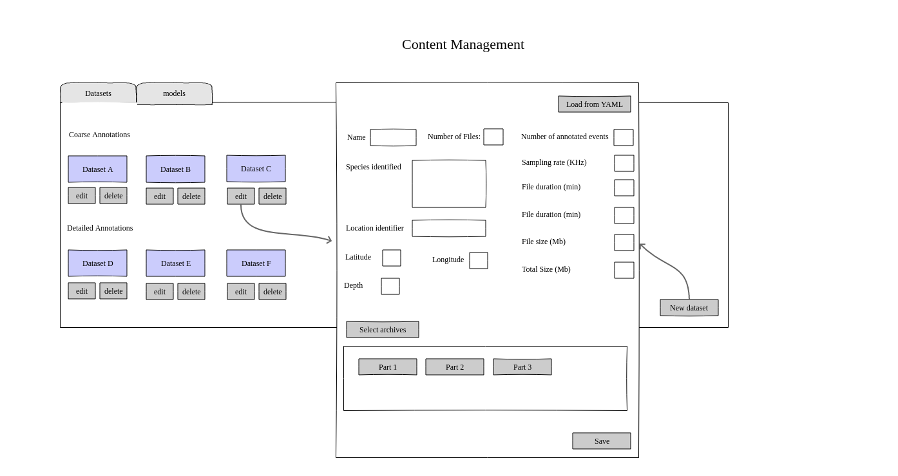

## Development Plan

### Software structure

The HALLO data portal is designed as a simple content management system (CMS).
Visitors can access content such as an overview of available datasets, details on each dataset, summary plots and performance metrics for different models. More importantly, visitors can download data.
On the other hand, content can be managed by a data manager with access to the datasets, who can add new datasets, edit metadata, add performance reports for models, etc.

The front and backend are decoupled, communicating via a REST API.
The portal is implement using the Postgres (database), Django + DjangoRestFramework (backend) and React (frontend) stack:

### Datasets

Datasets are offered as pre-bundled compressed archives (.zip)
Each dataset might be divided into several parts, each with its respective .zip, to make downloads more manageable for the users.

Each .zip archive has:
- audio files
- a .yaml file with deployment metadata
- a .tsv (tab-separated values) file with the annotations corresponding to those audio files

In addition the the subdivided annotations within the bundles, each dataset will also have a single annotation .tsv file with all annotations joined together.

*TO DO: list all the metadata fields that the yaml should have.*

### Annotations
Annotations are tables categorizing signals in specific time intervals within the audio recordings.
Most of the data is only annotated to the species level (here called "coarse level"), this is, they only inform users of which species is present in a certain time interval.
A subset of the datasets is also annotated to a higher degree of detail, including information on the killer whale ecotypes, pods, call types and comments.
These are called "detailed" annotations/datasets in the portal

Here is an example of detailed annotation table:

|filename  |start   | end | freq_min | freq_max | sound_id_species | kw_ecotype | pod | call_type | comments | duration |
|----------|--------|-----|----------|----------|-------|------------------|------------|-----|-----------|-------------|
|JASCOAMARHYDROPHONEC000682_20171103T150328.359Z.wav | 52.88 | 54.53| 1588.4 | 2322.5 | Vessel Noise | | | | Engine noise| 1.65 |
|JASCOAMARHYDROPHONEC000682_20171103T150328.359Z.wav | 78.61 | 81.58 | 1444.0 | 4960.3 | KW | KWSR | J | S17 | very clear call | 2.97 | 

And a coarse annotation table:

|filename  |start   | end | freq_min | freq_max | sound_id_species| duration|
|----------|--------|-----|----------|----------|-----------------|---------|
|JASCOAMARHYDROPHONEC000682_20171103T150328.359Z.wav | 52.88 | 54.53| 1588.4 | 2322.5 |KW | 1.65 |
|JASCOAMARHYDROPHONEC000682_20171103T150328.359Z.wav | 78.61 | 81.58 | 1444.0 | 4960.3 | KW  |  2.97 |

In the data portal, they are distributed as .tsv files.

### User roles and permissions

**Visitor** 
Visitors don't have an account. They can read the about page, browse the datasets available, see the model benchmarks and dataset details.
Visitors cannot download data without registering

**Registered user** 
Can do everything visitors can do and also download data from the dataset details page.

**Data manager** 
Can do everything registered users can do and also have access to the *data management* page.
Data managers can perform Create, Update and Delete datasets and model benchmark records.

**Admin** 
The admin is the only role with access to the admin side of the application (Django admin), and can manipulate the database. This role can create user accounts, assign roles and, of course, perform CRUD operations through the same database models accessible to the *data manager* role.

The following table summarizes the permissions for each page.

| Page            | Login required | Role                 |
| -------------   |:-------------: |:--------------------:|
| About           | False          |   Any                |
| Datasets        | False          |   Any                |
| Benchmarks      | False          |   Any                |
| Dataset details | True           | Any role can view, only registered users can download |
| Data management | True           | Data manager         |
| Admin           | True           | Admin (superuser)    |

### Frontend

**About page**

A page describing the data portal and its goals.
This will be the home page and should give visitors an overview of the portal

*TO DO: Add the text that will go in the about page*

Mockup:

**Datasets page**
This page lists datasets available.
It allows visitors to filter datasets using a variety of criteria.
This page has a couple of visualizations, showing the local of the selected/filtered datasets in a map, as well as plots summarizing the annotations on different levels.

*TO DO: list all the filter options*

Mockup:

**Benchmarks page**

This pages shows performance benchmarks for models tested on the datasets available through the portal.

*TO DO: Add the text explaining what are the benchmarks in this page, how they are calculated, etc*

Mockup:

**Dataset details page**

This page shows details for each of the datasets available.
Each dataset might be subdivided into several parts to make downloads more manageable.
Anyone can see these pages but the download buttons are disabled until the user logs in.

The page also display some plots summarizing information about the dataset, particularly regarding the number of annotations present.

*TO DO: List all fields that will describe  datasets in the "Datasets" section."

Mockup:

**Data management page**
This page is not visible to visitors or registered users.
Users with "Data manager" role can view/use this page to add/remove/update datasets and benchmark records.
This is done by filling a for, but there is also an option to import this information from a yaml file, which would partially or completely fill the form.

Mockup:

**Admin page**
This is the Django admin page and will only be accessed by the portal's admin.

